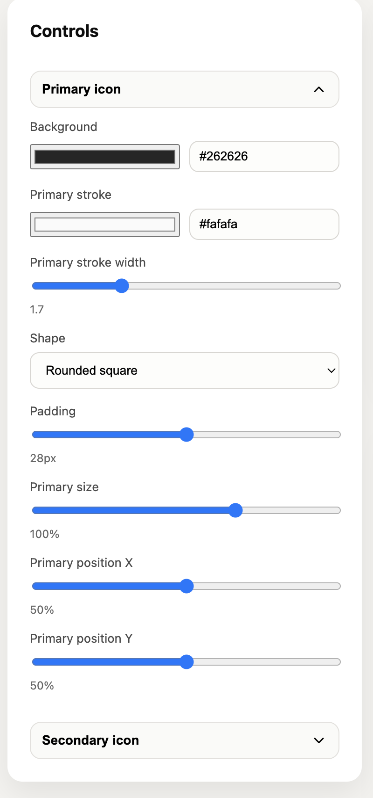

# Icon Generator (Lucide)

A Vite + React app to generate Chrome extension icons from Lucide icons.



## Features
- Pick primary and secondary icons from the full Lucide set
- Searchable icon grid with name previews
- Separate stroke width + color controls for each icon
- Optional secondary background with color + opacity + shape
- Position + scale controls for both primary and secondary icons
- Export PNG sizes: 16/32/48/128 by default, optional 256/512/1024
- Export a composite SVG
- Collapsible sections for cleaner controls

## Run
```bash
npm install
npm run dev
```

## Use
1. Select your icons in the grid
2. Tune colors, stroke, and positioning
3. Click Download PNGs or SVG
4. Move the PNGs into your extension `icons/` folder

## Notes
- The sidebar can be hidden to give the preview more space.
- Extra sizes are opt-in using the size chips.
